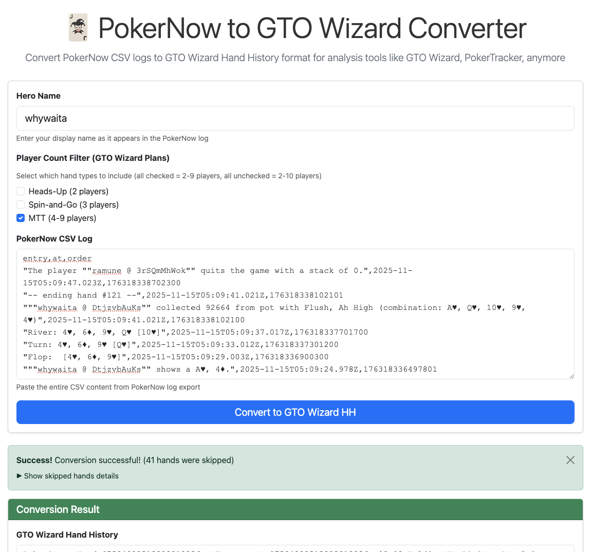

# pokernow2gw

Convert poker logs to GTO Wizard Hand History format (MTT).

## Notice

This software is not intended to promote or direct users to any online casino sites or applications. It utilizes Poker Now, a completely free platform, solely for the purpose of studying and improving gameplay.

## Motivation

[PokerNow](https://www.pokernow.club/) is an excellent free platform for playing poker with friends, including MTT (Multi-Table Tournament) games. However, when you want to analyze your gameplay using professional poker analysis tools like [GTO Wizard](https://www.gtowizard.com/), [PokerTracker](https://www.pokertracker.com/), or [Hold'em Manager](https://www.holdemmanager.com/), you'll encounter a compatibility issue.

## Features

- Web interface (WASM) for browser-based conversion using Go 1.24+ `go:wasmexport`
- Command-line interface for batch conversion (see [AGENTS.md](./AGENTS.md) for CLI usage)
- Supports multiple input formats:
  - PokerNow CSV log format
  - OHH (Open Hand History) JSON format
  - JSONL (JSON Lines) for multi-hand processing
- Automatic format detection
- Outputs GTO Wizard-compatible Hand History format

## GTO Wizard Recommendations

To analyze your converted hand histories in GTO Wizard:

1. **GTO Wizard account**
   - Free accounts can upload a limited number of hands
   - For unlimited uploads, a paid subscription is recommended
   - Check the [GTO Wizard pricing page](https://www.gtowizard.com/) for plan details

2. **How to upload hand histories to GTO Wizard:**
   - Follow the official guide: [How to Upload Your Hand Histories](https://help.gtowizard.com/how-to-upload-your-hand-histories/)

## Usage

### Web Interface (Recommended)

#### Online Version (GitHub Pages)

The easiest way to use pokernow2gw is through our online version:

**https://whywaita.github.io/pokernow2gw/**

No installation required - just open the link and start converting!

### Local Version / Command Line Interface

For CLI usage and development information, see [AGENTS.md](./AGENTS.md).

## Important Notes

### Ante Handling

When converting hands where all players post antes (all-in ante format), this tool automatically converts them to Small Blind (SB) and Big Blind (BB) format. This is because GTO Wizard and other analysis tools do not support the all-ante format in their hand history parsers.

**Why this conversion happens:**
- PokerNow supports all-ante tournament structures
- GTO Wizard and similar tools only support SB/BB tournament structures
- To maintain compatibility with analysis tools, antes are automatically converted to blinds

**Example:**
- PokerNow log: All players post 100 ante
- Converted output: Player posts 50 SB, Player posts 100 BB

This conversion allows you to analyze hands in GTO Wizard and other tools, even though the exact blind structure differs from the original game.
